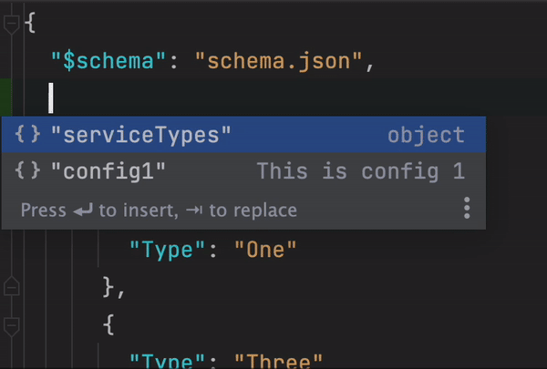

Description
-----------
- automatically generates documentation from your application appsettings
- it injects your assembly and scrappes your services.Configure<,>(Configuration.GetSection(("xx"")))
- currently supports documentation into MD and JsonSchema format
  - MD output example [here](WebApplication1/md_flat_documentation.md)
  - JsonSchema output example [here](WebApplication1/schema.json)
    - You can use other popular libraries to generate the documentation from JsonSchema for example https://github.com/coveooss/json-schema-for-humans
    - JsonSchema can also be used for auto completion in your appsettings.json
    - 


Installation
------------
1. Add this NuGet package into your project:

`AppSettingsDocGenerator.Scrapper`

2. Install dotnet tool for executing the documentation generation

`dotnet tool install --global AppSettingsDocGenerator`


Usage
-----

1. Implement `AppSettingsDocGenerator.Scrapper.IConfigurationInstaller` into your Startup class

2. Your current appsettings registration should look something like this:

```c#
class Startup {
   ...

  public void ConfigureServices(IServiceCollection services) {
  
    services.Configure<DatabaseConnection>(configuration.GetSection("Connection"));
    services.Configure<FeatureSettings>(configuration.GetSection("Features"));
  
  }

  ...
}
```

Add them into `AddConfigurations` method and use `ConfigureWithDocs` instead of just `Configure`

```c#
class Startup : IConfigurationInstaller {

    public IServiceCollection AddConfigurations(IServiceCollection collection, IConfiguration configuration)
    {
        services.ConfigureWithDocs<DatabaseConnection>(configuration.GetSection("Connection"));
        services.ConfigureWithDocs<FeatureSettings>(configuration.GetSection("Features"));
        
        return collection;
    }
    
    public void ConfigureServices(IServiceCollection services) {
        // register settings
        AddConfigurations(services, Configuration)
        
        // other services
        ...
    }
    
}
```

3. You can now generate documentation via `appsettings_generator [csproj path]` so for example `appsettings_generator WebApplication/WebApplication.csproj --output-type MdFlat -o app_docs.MD --title "Title for my documentantation"`

4. (OPTIONAL) Enable this in your csproj:

```xml
<PropertyGroup>
  <GenerateDocumentationFile>true</GenerateDocumentationFile>
</PropertyGroup>
```

this will allow scrape your `<summary>` comments above settings classes and their properties

```c#
/// <summary>
/// This is description of this settings class and will appear in the documentation
/// </summary>
class DatabaseConnection {
    /// <summary>
    /// This is description of this property and will appear in the documentation
    /// </summary>
    public string ConnectionString { get; set; }

}
```

appsettings_generator options
-----------------------------

usage `appsettings_generator [path_to_csproj_or_dll]`

| Name                | Option            | Description                                      |
|---------------------|-------------------|--------------------------------------------------|
| Output type         | -t, --output-type | supported - JsonSchema or MdFlat                 |
| Output path         | -o, --output      | file path, where the documentation will be saved |
| Documentation title | --title           | generated documentation title                    |
| Help                | --help            | prints help page                                 |


Docker
------
You can generate documentation with docker instead of dotnet tools

usage: `docker run --rm -v $(pwd):/source twinity/appsettings-doc-generator:1.0.0 WebApplication1/WebApplication1.csproj ... other options`

Limitations
-----------
- currently there is no support for recursive class referencing (recursive property will be automatically excluded)

